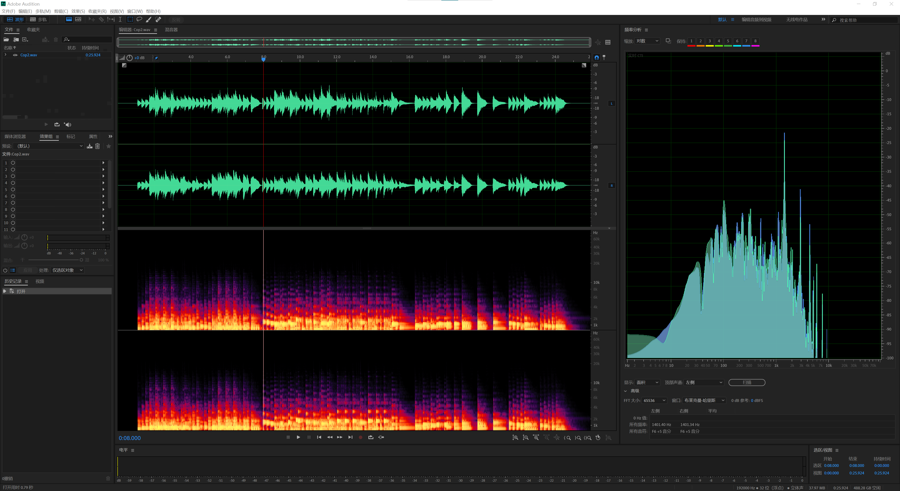

# How to optimize your matlab program

Matlab作为一个全能型软件兼解释型语言，在科研、工程设计、仿真模拟等多个领域都具有不可撼动的地位，曾经有人开玩笑道：“matlab除了不能给你生孩子，其它的都能干。相信在座的各位都或多或少使用过matlab。但是，在功能方面可以说神功大成的matlab其实也有一个比较重大的缺陷，那就是慢。做算法的诸位，包括我本人，我相信对matlab强大的功能印象深刻的同时，也会在无数个瞬间突然产生这样一个念头：

如果matlab更快一点就好了。

不同于编译型语言的汇编，C、C++，Go，Rust，解释型语言是带有先天不足的。解释型语言是由解释器运行的，它的特点是就是自由和慢。由于几乎所有的解释型语言都带有自动垃圾回收，所以我们可以轻松愉快地编写各种代码而不用担心变量的作用域和内存泄露等问题，自动垃圾回收会帮助你解决一切；而这种随心所欲的代价就是，由于需要解释器实时地逐行执行语句，以及执行垃圾回收需要时间而导致的效率低下。

那么，有没有办法让matlab变快一些呢？

## 一个例子

接下来，我将使用一个经典算法的实现向各位读者介绍如何优化你的matlab。这个算法就是FFT-Fast Fourier Transform，快速傅里叶变换。快速傅里叶变换可以帮助我们对一段任意长度的离散信号进行频域分析，也就是说，它是这样一个有魔力的机器，可以将一段信号输入，吐出来的却是一些频率和幅度均不同的正弦波。其在工程与学术界得到了极其广泛的应用，广泛到这个本来看起来非常不可思议的算法已经事实上成为了大量学术理论和工程应用的基石。要知道，这个理论最开始受到拉格朗日的强烈反对，因为他怎么也想不明白任意一个连续函数是如何能被分解成无数个正弦函数的。

这里有一个非常经典的例子。我使用FL Studio写了一段简单的钢琴曲，将导出的音频文件放进Adobe Audition来看一看：

## 喝点咖啡，写点Java

Matlab与Java的关系是及其紧密的。Matlab向Java开放了大量的底层接口，用户在进行开发时可以选择直接将Java代码嵌入Matlab中。
